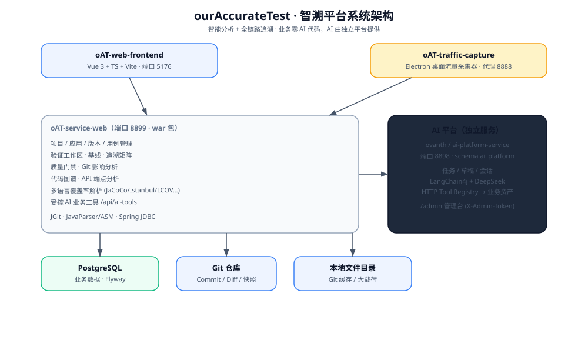
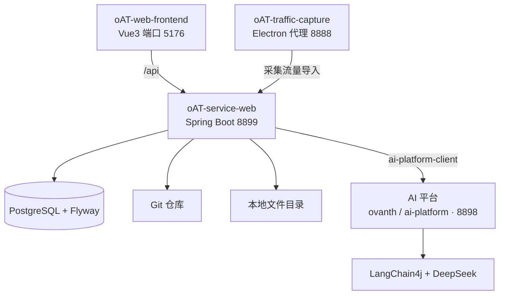

# ourAccurateTest

`ourAccurateTest` 是服务于研发与质量团队的**智溯平台**。“智溯”代表智能分析与全链路追溯，项目将需求、用例、源码、版本变更、运行证据和覆盖率数据组织为可追溯关系，并通过静态分析、运行证据投影和 LLM 辅助发现覆盖缺口、实现偏差和质量门禁风险。



> 本项目仅供个人学习、技术研究与交流使用。请在使用前确认第三方组件、代码仓库、流量采集对象和模型服务的授权，不要将生产密钥、证书或敏感流量提交到代码仓库。

## 系统组成



## 模块总览

```text
ourAccurateTest/
├── oAT-service/                # 服务端 Maven 聚合模块
│   └── oAT-service-web/        # Spring Boot 业务主服务（war）
├── oAT-web-frontend/           # 平台 Web 前端（Vue 3）
├── oAT-traffic-capture/        # Electron 桌面流量采集器
├── docs/                       # 文档图片与交流资源
└── scripts/                    # 辅助脚本
```

> AI 能力由**独立 AI 平台**提供（独立 git 仓库 `ai-platform` / 当前代码库 `ovanth`），业务通过客户端 artifact 接入，本仓库业务零 AI 代码。

## 模块文档

| 模块 | 说明 | 文档 |
| --- | --- | --- |
| 服务端聚合 | 构建 `oAT-service-web` 的 Maven 父模块 | [oAT-service/README.md](oAT-service/README.md) |
| 后端主服务 | Spring Boot 业务 API、迁移、验证图谱、质量门禁、AI 业务工具 | [oAT-service-web/README.md](oAT-service/oAT-service-web/README.md) |
| Web 前端 | Vue 3 平台前端，项目管理 / 版本 / 图谱 / 验证 / 门禁 | [oAT-web-frontend/README.md](oAT-web-frontend/README.md) |
| 流量采集器 | Electron 桌面流量采集、过滤、重放、导出 | [oAT-traffic-capture/README.md](oAT-traffic-capture/README.md) |

## 核心能力

- **验证工作区**：导入需求、用例、源码、执行报告、覆盖率和 Git 源码快照。
- **验证基线**：以一组资产快照建立分析基线，保存证据、状态和分析结果。
- **一致性分析**：结合 LLM 与结构化证据生成追溯边、风险发现和分析摘要。
- **追溯矩阵与图谱**：查看需求、用例、源码、运行证据、覆盖率和 AI 发现之间的关系。
- **质量门禁**：配置门禁策略、评估基线结果、记录豁免并识别 stale 状态。
- **Git 影响分析**：基于 Commit/Diff 分析变更范围并联动图谱过期标记。
- **代码与 API 分析**：解析 Java 源码、字节码和接口端点，支撑版本对比与影响定位。
- **多语言覆盖率解析**：支持 JaCoCo、Istanbul、LCOV、gcov、go cover 和 coverage.py。
- **桌面流量采集**：采集、过滤、查看、重放和导出 HTTP/HTTPS、WebSocket、MQTT 等流量。

## 技术栈

| 模块 | 技术 |
| --- | --- |
| 后端 | Java 17、Spring Boot 3.4.4、Spring JDBC、Druid |
| AI | LangChain4j 1.12.2、OpenAI 兼容接口、DeepSeek、Ollama |
| 数据库 | PostgreSQL、Flyway |
| 源码与覆盖率 | JGit、JavaParser、ASM、JaCoCo、Istanbul、LCOV、gcov、go cover、coverage.py |
| Web 前端 | Vue 3、TypeScript、Vite 7、Vue Router、Pinia |
| 流量采集器 | Electron 30、Vue 3、Vite 5、http-mitm-proxy、better-sqlite3、ws、mqtt、ExcelJS |

## 环境要求

- JDK 17+
- Node.js 18+
- PostgreSQL 12+（建议使用仍在维护的版本）
- 可访问的 Git 仓库
- 可选：Maven 3.8+；仓库内提供 `oAT-service/oAT-service-web/mvnw`
- 可选：OpenAI、DeepSeek、Ollama 或兼容 OpenAI 协议的模型服务
- 可选：macOS 证书信任权限，用于桌面采集器解密 HTTPS/WSS

## 快速开始

### 1. 配置并启动后端

```bash
export OAT_DB_URL='jdbc:postgresql://127.0.0.1:5432/ai_requirement_verification'
export OAT_DB_USERNAME='traceiq'
export OAT_DB_PASSWORD='change-me'

cd oAT-service/oAT-service-web
./mvnw -f ../pom.xml clean package -DskipTests
./start.sh
```

后端监听 `http://localhost:8899`，迁移由 Flyway 自动执行（`oAT-service/oAT-service-web/src/main/resources/db/migration/`）。本地数据目录默认 `${user.home}/oAT/codeData/`。

### 2. 启动独立 AI 平台

AI 平台已拆分为独立 git 仓库（本地路径 `../ai-platform/`，当前代码库 `ovanth`）。业务通过客户端 artifact 接入，本仓库业务零 AI 代码。

```bash
cd ../ai-platform
export AI_PLATFORM_API_KEY='your-api-key'
export AI_PLATFORM_ADMIN_TOKEN='your-admin-token'
export AI_TOOL_GATEWAY_TOKEN='local-ai-tool-token'   # 须与业务端 OAT_AI_TOOL_TOKEN 一致
java -jar ai-platform-service/target/ai-platform-service-0.1.0-SNAPSHOT.jar
```

AI 平台监听 `http://localhost:8898`，管理台 `http://localhost:8898/admin`。

### 3. 启动 Web 前端

```bash
cd oAT-web-frontend
npm install
npm run dev        # http://localhost:5176，默认代理到 http://localhost:8899
```

### 4. 启动桌面流量采集器

```bash
cd oAT-traffic-capture
npm install
npm run dev        # 渲染进程 5173，本地代理 8888
```

## 常用命令

| 目录 | 命令 | 说明 |
| --- | --- | --- |
| `oAT-service` | `./oAT-service-web/mvnw -f pom.xml test` | 运行服务端测试 |
| `oAT-service` | `./oAT-service-web/mvnw -f pom.xml clean package -DskipTests` | 打包服务端 |
| `oAT-web-frontend` | `npm run dev` / `npm run build` | 启动 / 类型检查并构建前端 |
| `oAT-traffic-capture` | `npm run dev` / `npm run build` / `npm run dist` | 开发 / 构建 / 生成安装包 |

## 配置入口

| 配置 | 文件 |
| --- | --- |
| 后端端口、数据库、Flyway、LLM、本地存储 | `oAT-service/oAT-service-web/src/main/resources/application.yml` |
| AI 平台（端口、模型、管理台 Token、业务回调） | `../ai-platform/ai-platform-service/src/main/resources/application.yml` |
| Web 前端代理和端口 | `oAT-web-frontend/vite.config.ts` |
| 流量采集器 Electron 打包 | `oAT-traffic-capture/package.json` |
| 流量采集器 Vite 端口 | `oAT-traffic-capture/vite.config.ts` |

## GitHub Pages

项目站点位于 `docs/`，通过 `.github/workflows/pages.yml` 在推送到 `master` 或 `main` 分支时自动部署。

仓库地址：

```text
https://github.com/000xiaoxiao000/ourAccurateTest.github.io.git
```

在 GitHub 仓库的 `Settings -> Pages` 中，将发布来源设置为 `GitHub Actions`。部署完成后，项目站点通常访问：

```text
https://000xiaoxiao000.github.io/ourAccurateTest.github.io/
```

## 交流与反馈

项目交流资源位于 `docs/assets/`：

| 添加作者微信 | 微信公众号入口 | AI + 精准测试实战交流群 |
| --- | --- | --- |
|  |  |  |
