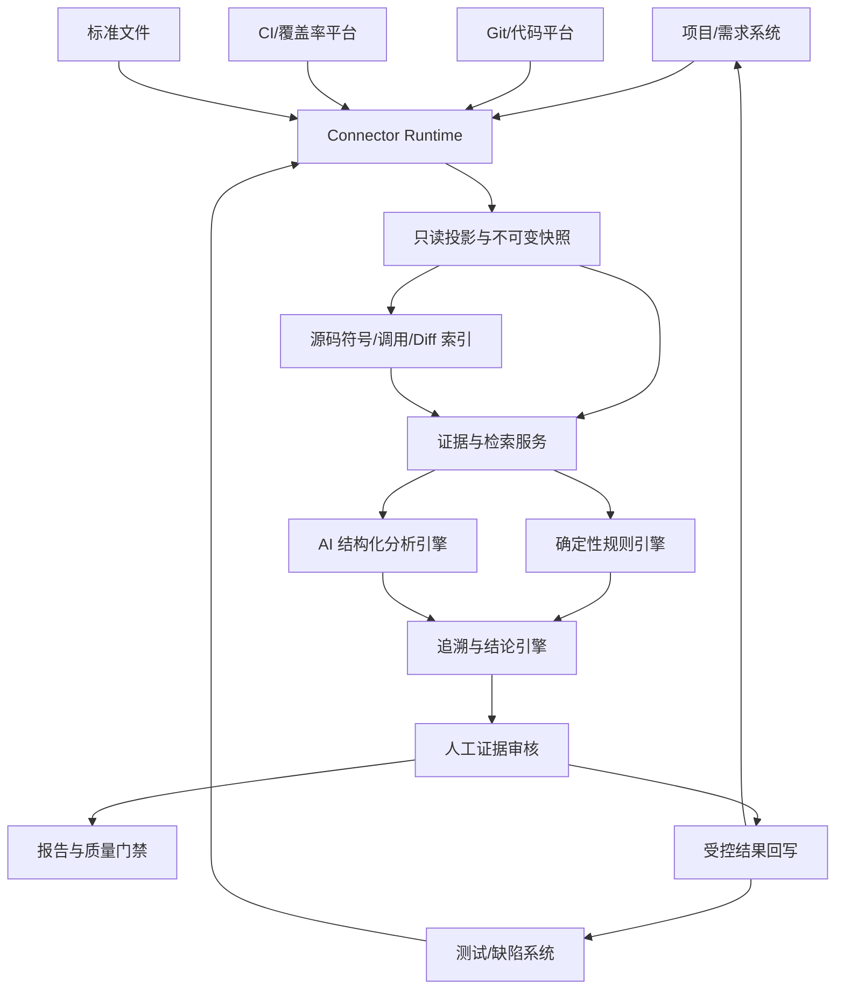

# AI 需求一致性验证平台重构方案与实施计划

> 文档状态：优化评审版  
> 编制日期：2026-07-10  
> 重构目标：将现有平台改造为连接企业研发数据源、以 AI 为核心的需求一致性验证平台  
> 本轮范围：方案与计划，不涉及业务代码、配置和数据库修改。

## 1. 执行结论

新平台不是另一套项目管理、需求管理、测试管理或缺陷管理系统，而是位于客户现有工具链之上的**联邦式 AI 验证层**。

```text
需求/项目平台       测试平台       Git/代码平台       CI/覆盖率平台
      \                |                |                  /
       \---------------连接器与文件接入层-----------------/
                              |
                    不可变分析快照与证据索引
                              |
                       AI 一致性验证引擎
                              |
       需求歧义 | 用例缺失/错误 | 代码缺失/偏差 | 交叉盲区
                              |
                   人工确认、回写、复验、门禁
```

平台只回答一个核心问题：

> 在指定的需求、测试用例和源代码版本下，测试用例与代码是否满足需求；若不满足，缺什么、错在哪里、证据是什么、应回到哪个外部系统处理。

重构遵循五条原则：

1. **外部平台是事实源**：不要求客户迁移或重复维护需求、用例、Bug、成员和工作流。
2. **AI 是核心价值**：连接和存储只服务于语义追溯、查漏、找错和变更影响分析。
3. **证据优先**：AI 结论必须引用真实需求、用例、源码或执行证据。
4. **人机协同**：AI 生成候选和建议，高风险结论、回写与豁免由人确认。
5. **版本可复现**：每次分析冻结输入和分析器版本，资产变化后旧结论自动失效。

## 2. 产品边界

### 2.1 外部事实源与本地数据

| 数据 | 默认事实源 | 本平台仅保存 |
|---|---|---|
| 项目、迭代、成员 | Jira、TAPD、禅道、PingCode 等 | 外部引用、分析范围、权限映射 |
| 需求及版本 | 需求/项目管理平台 | 分析快照、内容哈希、AI 提取的验收标准 |
| 测试用例及执行 | Xray、TestRail、MeterSphere、禅道等 | 分析快照、结构化投影、执行证据 |
| Bug/任务 | 缺陷/项目管理平台 | 外部事项链接、回写和同步状态 |
| 源代码 | GitLab、GitHub、Gitee、Bitbucket 等 | Commit、符号索引、必要代码片段 |
| 构建、覆盖率 | Jenkins、GitLab CI、Sonar、报告文件 | 分析批次、覆盖证据 |
| 追溯关系、AI 发现 | 本平台 | 完整主数据及审计记录 |

本平台真正拥有的数据只有：

- 连接配置、字段映射和同步游标；
- 分析工作区、范围和不可变基线；
- AI 生成的验收标准投影；
- 需求、用例、代码与执行证据之间的追溯边；
- AI 发现、置信度、人工裁决和豁免；
- 模型、Prompt、规则和分析器版本；
- 门禁结果、外部回写记录和审计日志。

### 2.2 明确不建设

- 完整需求编辑器、需求审批、迭代规划和需求状态流；
- 完整用例库、测试计划、执行调度和自动化测试平台；
- Bug 生命周期、看板、评论、工时、通知和人员分派系统；
- 与企业现有体系重复的组织、成员和权限系统；
- 要求客户永久迁移全部需求、用例和缺陷数据的数据仓库。

外部资产需要修改时跳回事实源。本平台只保留 `待确认、已确认、已驳回、已回写、已过期` 等最小分析状态。

### 2.3 接入方式

1. **连接器模式，生产首选**：通过 REST API、Webhook、厂商插件或客户侧 Agent 读取数据，并可选择性回写结果。
2. **文件模式，试用和兜底**：上传 Word、PDF、Markdown、Excel、CSV、源码包和覆盖率报告，只形成一次分析批次。

不建议直接耦合客户数据库表。确需数据库接入时，应由客户侧适配器转换为平台标准协议。

### 2.4 无法从外部平台导入数据时的降级方案

外部平台没有开放 API、无法联网、数据不能出域或导出能力有限时，平台仍应支持 AI 验证，但不能因此建设第二套需求、用例或缺陷管理系统。按以下优先级降级：

1. **标准文件导入**：从原平台导出 Excel、CSV、Word、PDF、Markdown 或 JSON 后上传。平台负责模板识别、字段映射和 AI 结构化。
2. **复制粘贴或临时录入**：适合少量数据。用户粘贴需求正文、用例表格并填写外部 ID/链接，数据只属于当前分析批次。
3. **客户侧轻量 Agent**：部署在客户内网，读取、脱敏并转换为平台标准快照，适合无公网 API 或禁止数据直接出域的场景。
4. **定制连接器**：通过私有 API、SDK、定时导出目录、消息队列等方式接入重要客户系统。
5. **只读标准视图**：最后选择。由客户提供稳定只读视图或中间表，平台不直接依赖其业务数据库表结构，也不写入客户数据库。

最低输入字段：

| 资产 | 最低字段 |
|---|---|
| 需求 | 需求 ID、标题、正文、版本或更新时间 |
| 用例 | 用例 ID、标题、前置条件、步骤、测试数据、预期结果 |
| 源码 | 仓库与 Commit，或源码压缩包及生成时间 |
| Bug，可选 | Bug ID、标题、描述、状态、关联需求/用例 |
| 执行/覆盖率，可选 | 执行批次、用例结果、覆盖率文件和生成时间 |

每个非自动同步批次必须记录：

- 数据来源、导入方式和导入人；
- 外部版本；没有版本时记录内容哈希；
- 导入时间和数据截止时间；
- 是否自动同步；
- 无法确认的数据完整性；
- 报告有效性限制。

当来源不能自动同步时，平台无法感知原系统后续变化。报告必须明确标记“非自动同步”，重新上传后创建新基线，旧结果自动转为 `STALE`，不得继续作为当前发布结论。

平台可以按接入成熟度标记运行等级：

| 等级 | 输入方式 | 支持能力 |
|---|---|---|
| L1 临时分析 | 粘贴、临时文件 | 单次 AI 分析和报告 |
| L2 可重复分析 | 标准文件、明确代码 Commit | 基线、人工触发 Diff 和重新验证 |
| L3 持续验证 | API、Webhook 或客户侧 Agent | 自动变更感知、增量分析、回写和门禁 |

## 3. 核心用户流程

### 3.1 创建验证范围

1. 选择外部项目、迭代或需求集合，无法连接时选择文件/临时批次；
2. 选择测试计划、用例集合或测试报告，无法连接时上传标准文件；
3. 选择一个或多个代码仓库、分支和 Commit；
4. 按需选择 CI 执行、覆盖率或运行链路批次；
5. 平台检查连接健康度、权限、数据完整性和版本信息。

### 3.2 冻结分析基线

平台为当前输入生成不可变基线：

```text
需求外部版本/内容哈希
+ 用例外部版本/内容哈希
+ Git 完整 Commit SHA
+ 测试执行/覆盖率批次
+ 连接器、规则、Prompt、模型和分析器版本
= AnalysisBaseline
```

外部平台没有可靠版本号时，平台以内容哈希和抓取时间形成分析版本，但不得反向成为业务主版本。

### 3.3 AI 分析

平台自动完成：

1. 需求结构化与验收标准提取；
2. 需求、用例、代码的候选追溯；
3. 测试用例缺漏与错误分析；
4. 源代码实现缺漏与偏差分析；
5. 执行、覆盖率和代码 Diff 交叉验证；
6. 一致性断裂识别、去重和优先级排序。

### 3.4 审核与回写

审核人查看并列证据后，可以：

- 确认、驳回或要求补充证据；
- 将问题回写为外部 Bug、任务、评论、标签或用例改进项；
- 关联已有外部事项，避免重复创建；
- 在外部事项解决后触发重新验证；
- 对允许发布的风险执行有期限的豁免。

### 3.5 持续验证

需求、用例或代码发生变化后，平台只重跑受影响子图：

```text
外部变更/Webhook
 -> 新快照与 Diff
 -> 旧追溯和结论标记 STALE
 -> 定位受影响 AC、用例和代码
 -> 增量分析
 -> 更新门禁结果
```

## 4. AI 的核心价值

### 4.1 AI 应解决的问题

| AI 能力 | 传统规则的局限 | 平台输出 |
|---|---|---|
| 需求语义结构化 | 文档格式和表达方式不统一 | REQ、AC、约束、歧义、可测试性 |
| 跨系统语义追溯 | ID 缺失、术语和命名不同 | AC、用例、代码的候选关系及依据 |
| 用例充分性评审 | 覆盖率无法发现错误预期 | 缺失场景、边界、弱断言、错误预期 |
| 实现一致性审查 | 静态扫描不知道业务规则 | 需求与代码分支、常量、状态、异常的差异 |
| 交叉证据推理 | 数据分散且口径不同 | 假通过、实现未测、版本错位、无源变更 |
| 变更影响理解 | 关键词和文件 Diff 噪声高 | 受影响 AC、用例、代码和重验范围 |
| 建议生成 | 人工补写和定位耗时 | 可编辑用例草稿、修复方向和复验建议 |
| 企业语义校准 | 通用模型不了解内部术语 | 基于人工反馈优化术语和排序 |

### 4.2 AI 不负责的事情

- 不创建不存在的需求、用例、代码或执行事实；
- 不把行业常识冒充正式需求；
- 不因语义相似就判定需求已经满足；
- 不自动提交代码或直接修改外部用例；
- 不在未经人工确认时批量创建外部 Bug；
- 不单独决定严格发布门禁结果。

### 4.3 “3+2”分析流水线

手工的“需求、用例、源码三类输入 + 测试与代码两个视角 + 联动分析”转换为固定流水线：

```text
确定性解析和版本冻结
 -> AI 提取 REQ/AC、场景和业务约束
 -> 规则 + 检索生成追溯候选
 -> AI 用例分析
 -> AI 代码分析
 -> 规则 + AI 交叉验证
 -> 证据校验、去重和严重度计算
 -> 人工审核
```

禁止使用一个超长 Prompt 分析全项目。每个阶段使用固定 JSON Schema，通过工具按 ID 获取最小充分上下文。

### 4.4 AI 价值指标

AI 价值不以平台保存多少需求或 Bug 衡量，而以以下指标衡量：

- 人工建立追溯矩阵的时间下降比例；
- 人工评审单条 AC 的平均耗时；
- AI 问题确认率和高严重度误报率；
- 人工遗漏但 AI 成功发现的问题数；
- 补测建议采纳率和修改后通过率；
- 代码实现问题确认率；
- 变更影响分析准确率；
- 单 AC 的 Token、费用和端到端时延。

## 5. 双向追溯与分层验证

### 5.1 最小验证单位

最小验证单位是验收标准 `AC`，不是整篇文档或粗粒度需求标题。

```text
REQ-LOGIN-01 用户登录失败锁定
├── AC-01 密码连续错误 5 次后锁定
├── AC-02 前 4 次错误不锁定
├── AC-03 锁定后正确密码也不能登录
├── AC-04 锁定 30 分钟后自动解除
└── AC-05 管理员可以手工解锁
```

五条 AC 必须分别关联用例和实现，不能因存在一个“登录测试”就判定整条需求已覆盖。

### 5.2 正向追溯

```text
Requirement -> AC -> Testcase/Step -> SourceSymbol/Branch -> Execution/Coverage
```

检查每条 AC 是否有正确用例、可信实现和必要执行证据。

### 5.3 反向追溯

```text
Commit/File/Symbol/Branch -> Requirement/TechnicalReason -> Testcase -> Execution
```

检查代码变更是否有需求或技术原因、是否有测试保护。无需求关联只能先标为风险候选，不能直接判定为冗余代码；重构、安全修复和技术债都可能是合理来源。

### 5.4 四层验证

| 层级 | 核心问题 | 主要手段 |
|---|---|---|
| 追溯层 | 三类资产是否建立双向关系 | ID、字段映射、检索、AI 语义匹配 |
| 覆盖层 | 需求场景和代码分支是否覆盖 | AC 覆盖、行/分支覆盖、执行映射 |
| 正确性层 | 用例预期和代码逻辑是否符合需求 | AI 约束对比、断言检查、异常/边界分析 |
| 变更层 | 三类资产版本是否同步 | 需求/用例/代码 Diff、失效传播、增量分析 |

后续可接入 PIT、Stryker 等变异测试，验证修改判断或边界后现有用例是否失败。变异测试是增强证据，不是一期前置条件。

## 6. 判定与证据模型

### 6.1 结论状态

| 状态 | 判定 |
|---|---|
| `SATISFIED` | 用例、实现、动态执行证据和人工确认达到项目规定的证据门槛 |
| `STATICALLY_CONSISTENT` | 需求、用例与源码静态证据一致，但尚无充分动态执行证明 |
| `PARTIAL` | 有关联资产，但场景、实现或证据不完整 |
| `NOT_SATISFIED` | 存在经证据支持的明确遗漏或冲突 |
| `AMBIGUOUS` | 需求存在歧义或内部冲突 |
| `NOT_VERIFIABLE` | 当前资料或分析能力不足 |
| `EXEMPTED` | 经授权接受风险，且豁免仍有效 |
| `STALE` | 输入或分析器版本变化，原结论已经过期 |

### 6.2 证据等级

| 等级 | 证据 | 允许用途 |
|---|---|---|
| E0 | 关键词或 AI 推测 | 只生成候选 |
| E1 | 显式 ID、外部关联或人工关联 | 证明资产相关 |
| E2 | 可定位的源码符号、分支或约束 | 证明存在实现候选 |
| E3 | 测试执行通过且触达目标符号/分支 | 证明代码实际执行 |
| E4 | E3 + 断言与 AC 一致 + 人工确认 | 严格门禁的高可信证据 |

最终结论必须同时展示“判定状态 + 证据等级 + 数据新鲜度”，例如：

```text
STATICALLY_CONSISTENT / E2 / 文件数据截止 2026-07-10，非自动同步
```

`SATISFIED` 是“达到项目规定证据门槛”的工程结论，不代表数学意义上的形式化证明。默认情况下，没有运行数据只能输出 `STATICALLY_CONSISTENT`，不能输出 `SATISFIED`；项目若要降低门槛，必须形成显式、可审计的策略或豁免。

### 6.3 指标

```text
AC 用例覆盖率 = 有有效 VERIFIED_BY 关系的可测试 AC / 可测试 AC 总数
AC 实现覆盖率 = 有有效 IMPLEMENTED_BY 关系的需实现 AC / 需实现 AC 总数
代码行覆盖率 = 已执行代码行 / 可执行代码行
代码分支覆盖率 = 已执行分支 / 可执行分支
需求闭环率 = 达到项目证据要求的 AC / 纳入门禁的 AC 总数
变更响应率 = 已重新验证的受影响 AC / 本次受影响 AC 总数
```

不可测试、无需代码实现和有效豁免项必须显式确认后才能从分母排除。

### 6.4 问题分类

| 责任视角 | 主要类型 |
|---|---|
| 产品 | 需求歧义、需求冲突、不可测试、缺少验收标准 |
| 测试 | 缺少用例、异常/边界缺失、错误预期、弱断言、无效前置、用例过期 |
| 开发 | 未实现、逻辑偏差、分支不完整、缺少校验、错误行为不符、实现过期 |
| 交叉 | 用例未触达实现、实现无用例、假通过、追溯断裂、版本错位、无源代码变更 |

通用安全、性能和代码质量问题如果没有正式需求依据，应标记为 `ADVISORY`，不计入需求满足率。

## 7. 目标架构



一期采用模块化单体，先建立领域边界，不急于拆微服务。

### 7.1 连接器 SPI

分析域只依赖统一模型，不直接依赖具体厂商字段：

```text
Connector
├── capabilities()           声明需求、用例、执行、缺陷、回写等能力
├── discoverScopes()         获取项目、迭代、测试计划或仓库范围
├── fetchRequirements()      拉取需求及版本标识
├── fetchTestcases()         拉取用例和步骤
├── fetchExecutions()        拉取执行结果
├── fetchDefects()           可选，提供历史缺陷证据
├── fetchChanges(cursor)     增量同步
├── resolveExternalLink()    生成事实源链接
└── writeBackFinding()       可选，回写任务、Bug、评论或标签
```

要求：

- 连接器默认只读，回写能力单独授权；
- 支持字段映射、分页、限流、游标、Webhook 去重和幂等重试；
- 连接器版本和字段映射进入分析基线；
- 外部 API 不可用时可使用已冻结快照，但必须显示数据新鲜度；
- MVP 只实现通用文件和 Git 连接器；首个真实业务平台连接器在 AI 核心价值通过人工标注基准集验证后接入。

### 7.2 后端模块

```text
connector-runtime     外部系统连接、认证、同步和回写
snapshot-projection   外部资产只读投影与分析快照
source-analysis       仓库、Commit、符号、调用关系和 Diff
evidence-retrieval    证据引用、全文/语义检索和权限过滤
ai-verification       Prompt、工具、Schema 和分析编排
traceability          双向追溯、失效传播和矩阵
finding-review        AI 发现、最小裁决、豁免和外部事项链接
quality-gate          指标、报告和 CI 门禁
identity-admin        SSO、最小权限、模型和连接配置
```

### 7.3 分析任务状态机

```text
CREATED
 -> SNAPSHOTTING
 -> WAITING_PROJECTION_REVIEW
 -> INDEXING_SOURCE
 -> BUILDING_CANDIDATES
 -> VERIFYING_TESTCASES
 -> VERIFYING_CODE
 -> CROSS_CHECKING
 -> WAITING_FINDING_REVIEW
 -> COMPLETED
```

异常状态为 `FAILED`、`CANCELED`；输入变化后结果进入 `STALE`。每个阶段必须幂等、可重试、可从检查点恢复。

## 8. 轻量数据模型

| 实体 | 关键职责 |
|---|---|
| `AnalysisWorkspace` | 外部项目映射、分析范围和策略，不承载项目管理 |
| `DataConnection` | 系统类型、密钥引用、能力、字段映射和游标 |
| `ExternalAssetRef` | source、external_id、version、url、updated_at |
| `AssetSnapshot` | 分析所需内容、哈希、来源和抓取时间 |
| `AcceptanceCriterionProjection` | 从需求快照提取的 AC、约束和原文位置 |
| `TestcaseProjection` | 用例步骤、数据、预期和外部引用 |
| `SourceSnapshot` | 仓库、分支、Commit 和索引状态 |
| `SourceSymbol` | 文件、类、方法、分支和行号 |
| `TestExecution` | 测试执行批次及外部引用 |
| `CoverageEvidence` | 行和分支覆盖定位 |
| `AnalysisBaseline` | 本次分析全部输入及分析器版本 |
| `TraceLink` | 跨资产关系、生成方式、置信度和确认状态 |
| `Evidence` | 可定位、可校验、带哈希的证据 |
| `Finding` | 类型、严重度、置信度、结论和状态 |
| `ReviewDecision` | 确认、驳回、豁免及理由 |
| `ExternalWorkItemLink` | 外部事项 ID、URL 和同步状态 |
| `QualityGateResult` | 策略版本、结果和失败原因 |

存储规则：

- 不复制外部系统的评论、附件、工作流、成员和完整历史；
- 外部资产只保存引用、必要投影和分析快照；
- 高频分析字段规范化建表，扩展字段才使用 JSON；
- 快照和基线不可原地覆盖；
- 证据保存外部版本、内容哈希和精确定位；
- 大文件进入加密对象存储或本地受控目录；
- 快照支持两种合规模式：完整加密快照可独立复现；仅保存哈希和外部引用时，复现依赖外部资产仍可访问；
- 仅引用模式必须在报告中标记复现限制，不能用于要求离线独立复现的严格门禁；
- 向量索引只负责候选召回，不作为事实源。

## 9. 分析实现

### 9.1 需求结构化

先通过标题、编号、表格和列表进行确定性解析，再由 AI 提取：

- REQ、AC 和原文范围；
- 角色、前置条件、动作和结果；
- 正常、异常、边界、权限和状态场景；
- 数值、次数、长度、时限和逻辑约束；
- 非功能需求、歧义、冲突和可测试性；
- 解析置信度。

低置信或会改变需求含义的拆分必须人工确认。校正结果只作用于当前分析投影；需要修改原需求时回到事实源。

### 9.2 候选追溯

按强到弱使用以下信号：

1. 需求 ID、用例关联字段、Commit/PR 中的显式 ID；
2. API、错误码、状态、配置和数据库字段等精确标识；
3. 业务对象、动作和企业术语；
4. 全文及语义检索；
5. 真实静态调用、API 关系和运行链路；
6. 需求时间窗与代码 Diff。

候选召回与满足判定严格分离。相似度只能生成候选关系，不能证明满足。

### 9.3 用例验证

AI 先为每条 AC 构建场景模型，再与用例比较：

- 正常、异常和恢复路径；
- 等价类、最小值、最大值及临界上下界；
- 角色、权限和前置状态；
- 状态转换、并发、幂等和超时；
- 测试数据是否足够；
- 预期是否可观察、可判定且与需求一致；
- 是否重复、关联错误或版本过期。

输出结构化发现和可编辑补测草稿，不直接写入外部用例库。

### 9.4 代码验证

平台围绕候选实现获取最小源码上下文，比较：

- 常量、比较符、范围和逻辑组合；
- 状态转换、角色和权限；
- 返回值、错误码、异常和副作用；
- 校验位置及是否可绕过；
- 数据持久化、配置、数据库约束和外部调用；
- 明确需求涉及的事务、并发和幂等行为；
- 需求删除或变化后是否残留旧实现。

搜索不到实现不能立即判定“未实现”。必须先检查入口、调用关系、配置和数据约束；仍无证据时输出 `NOT_VERIFIABLE` 或待确认的 `MISSING_IMPLEMENTATION`。

### 9.5 交叉验证

结合两类 AI 结果、测试执行、覆盖率和代码 Diff，识别：

- 用例通过但预期错误；
- 用例存在但未触达目标实现；
- 代码实现存在但没有用例；
- 需求和用例一致、代码不一致；
- 需求和代码一致、用例不一致；
- 用例和代码共同偏离需求；
- 代码变更没有需求/技术原因或测试保护；
- 需求变更后用例或代码仍停留在旧版本。

Top 风险只汇总已经落库且证据有效的发现，汇总阶段不得生成新事实。

## 10. AI 可靠性与治理

### 10.1 职责边界

```text
确定性程序：版本、哈希、结构解析、Diff、符号、覆盖率、规则计算和引用校验
AI：语义拆分、候选判断、逻辑对比、交叉推理、解释和建议
人工：需求澄清、高风险确认、回写、误报处理和风险豁免
```

### 10.2 防幻觉

- AI 只能引用授权工具返回的资产；
- 服务端校验所有 REQ、AC、TC、文件、类、方法、行号和证据 ID；
- 不存在或已变更的引用不得进入正式结论；
- 正式发现至少包含一条支持证据；
- 无法判断时使用 `NOT_VERIFIABLE`；
- 行业隐含风险标记为 `ADVISORY`；
- 文档内容一律视为数据，防止 Prompt Injection；
- 工具默认只读并再次校验租户、工作区和资产权限；
- 模型输出经过 JSON Schema、枚举、引用完整性和去重校验。

### 10.3 人工标注基准集与发布治理

编码前建立包含 50 至 100 条代表性 AC 的**人工标注基准集**，由产品、测试和开发共同确认标准答案：

- AC 到用例和代码的真实关系；
- 缺失用例、错误预期、实现偏差和无问题样本；
- 正常、异常、边界、权限和状态场景。

每次模型、Prompt、规则或检索策略变更必须离线回归。若高严重度误报、虚假引用或成本超过发布阈值，不得上线。

## 11. 产品界面

一级导航建议：

```text
AI 验证 | 数据连接 | 追溯证据 | 分析结果 | 覆盖与执行 | 质量门禁 | 系统设置
```

| 页面 | 核心内容 |
|---|---|
| AI 验证 | 选择范围、冻结基线、启动分析、查看阶段进度和结论 |
| 数据连接 | 连接器、字段映射、同步健康、范围和只读快照预览 |
| 追溯证据 | AC 正向矩阵、代码反向视图、未关联和过期关系 |
| 分析结果 | 产品/测试/开发三个视图，筛选、证据审核和回写 |
| 覆盖与执行 | AC 覆盖、行/分支覆盖、闭环率、测试结果和变异证据 |
| 质量门禁 | 策略、失败原因、豁免、CI 调用和历史趋势 |
| 系统设置 | 模型、安全策略、SSO、连接器和审计 |

发现详情采用并列证据布局：

```text
需求原文与 AC | 用例步骤与预期 | 源码、Diff 与执行证据
-----------------------------------------------------
AI 结论 | 证据等级 | 不确定性 | 补测/修复建议
-----------------------------------------------------
确认 | 驳回 | 补充证据 | 回写外部系统 | 豁免 | 重新验证
```

通用聊天只作为基于当前证据的辅助追问，不作为主流程或正式结论存储方式。

## 12. 质量门禁、安全与成本

### 12.1 质量门禁

门禁只读取结构化结论，不解析 AI 自然语言。策略可配置：

- 核心 AC 用例覆盖率和实现覆盖率；
- 已确认的严重用例错误和实现偏差数量；
- 核心需求歧义是否关闭；
- 变更关键分支覆盖率；
- 代码变更是否具有需求/技术原因和测试保护；
- 基线是否过期；
- 豁免是否具有审批人、原因和有效期。

发布顺序：`影子计算 -> 仅告警 -> 指定项目阻断 -> 稳定后扩大范围`。

### 12.2 安全

- 连接器使用最小权限，默认只读，回写单独授权；
- 企业部署优先使用 SSO 和外部项目映射；
- 密码、Token、密钥和敏感配置不进入 Prompt、报告和日志；
- 支持外部模型、本地模型、禁止源码出域和片段脱敏策略；
- 仅向模型发送当前 AC 所需的最小内容；
- 上传文件进行类型、大小和恶意内容检查，解析器隔离运行；
- 分析、下载、审核、回写和豁免全部审计；
- 外部回写由人工确认目标项目、事项类型和字段；
- 数据保留、删除和加密策略按租户配置。

### 12.3 成本与性能

- 显式 ID 和规则优先，全文/语义检索次之，LLM 最后验证；
- 使用内容哈希缓存解析、检索和分析结果；
- 以 AC 和源码符号为最小任务，设置 Token、并发和费用上限；
- 使用三类 Diff 做增量重跑；
- 小模型负责分类，大模型只处理复杂语义冲突；
- 大型矩阵使用服务端分页和虚拟列表；
- 记录每阶段 Token、费用、耗时和缓存命中率。

## 13. 现有平台处置

现有实现只作为可复用资产，不约束目标产品。

| 现有能力 | 处置 | 原因 |
|---|---|---|
| 登录、项目权限 | 收缩并改造 | 企业优先 SSO，项目只映射外部范围 |
| Git、Commit、Diff | 保留并下沉 | 作为源码连接器和基线能力 |
| JavaParser、源码提取 | 保留并重构 | 形成 `SourceSymbol` 和代码证据 |
| 用例导入导出 | 改为文件连接器 | 不再作为企业用例事实源 |
| LangChain4j、模型切换 | 保留并下沉 | 作为 AI Runtime |
| 流式输出 | 保留 | 展示分析任务事件和辅助解释 |
| 本地用例中心、PRD 字符串关联 | 替换 | 无法表达外部版本、AC 和正式证据关系 |
| 自由文本 AI 主流程 | 替换 | 不可复现、不可审计、无法用于门禁 |
| 旧版本影响用例模型 | 替换 | 只能说明代码影响，不能证明需求满足 |
| 链路地图、在线应用、流量采集 | 插件化或移出主产品 | 仅在能提供分析证据时启用 |
| 通用搜索 | 移出主导航 | 避免稀释 AI 验证主流程 |

采用“新核心旁路建设、逐步切换”，而不是继续在旧实体上堆字段：

```text
旧平台保持可用
 -> 建设 connector/snapshot/evidence/ai-verification 新核心
 -> 旧数据转换为文件数据源或外部引用
 -> 新流程通过准确性和回归验收
 -> 切换主导航
 -> 旧模块插件化、只读归档或下线
```

## 14. 实施路线

### 14.1 MVP 范围

```text
一个标准文件连接器
+ 一个 Git 连接器
+ 一个指定 Java Commit
 -> REQ/AC 提取与人工确认
 -> 双向追溯候选
 -> 用例缺漏/错误分析
 -> 代码缺漏/偏差分析
 -> 交叉盲区分析
 -> 证据化结果、矩阵和 Markdown/Excel 报告
```

MVP 不以覆盖率、CI 阻断、多语言、全部厂商连接器和变异测试为前置条件。

### 14.2 阶段计划

| 阶段 | 目标 | 主要交付 | 退出标准 |
|---|---|---|---|
| 0. 基准集与契约 | 固定正确问题和判定方式 | 50-100 条 AC 人工标注基准集、连接器规范、AI Schema、页面流程 | 产品/测试/开发共同确认 |
| 1. 数据与基线 | 建立轻接入和可复现输入 | 文件/Git 连接器、Connector SPI、只读投影、源码索引、Baseline | 无需外部厂商 API 即可创建基线 |
| 2. 追溯 | 建立正向和反向关系 | 候选召回、证据、确认、矩阵、失效机制 | 每条关系可解释、可定位、可失效 |
| 3. AI 核心 | 输出可行动的问题 | 用例、代码、交叉分析器，证据校验，结果审核 | 虚假引用为 0，达到人工标注基准集阈值 |
| 4. 外部集成闭环 | 接入首个真实业务平台 | 厂商连接器、Bug/任务/评论回写、状态同步、重新验证 | 无重复事项，外部状态可追踪 |
| 5. 动态证据 | 增强证明能力 | JaCoCo/JUnit、代码触达、闭环率、可选 PIT | 指标可下钻到 AC、用例和分支 |
| 6. 持续门禁 | 支持日常交付 | 三类 Diff、增量分析、CI API、豁免 | 影子运行稳定后可选择阻断 |
| 7. 切换退场 | 完成产品重构 | 新主导航、旧数据映射、旧模块下线清单 | 核心流程不依赖旧页面和旧 AI 对话 |

阶段 3 是产品价值验证点。如果 AI 准确性和人工节省时间未达到约定目标，应先优化数据、检索和评测，不应继续扩张 ALM 功能或连接器数量。

### 14.3 实施前置决策

1. 首批客户实际使用哪些需求、测试、缺陷、代码和 CI 平台；
2. MVP 文件模式支持哪些格式，阶段 4 首个真实平台连接器选择哪个系统；
3. 一期是否只正式支持 Java；
4. 源码是否允许发送外部模型，是否强制本地模型；
5. 快照允许保存哪些字段、保留多久、如何加密；
6. 首批人工标注基准集项目及产品、测试、开发标注负责人；
7. 回写使用 Bug、任务、评论还是标签，谁拥有回写权限；
8. `SATISFIED` 的动态证据要求、最低证据等级和门禁阈值；
9. 使用 SSO、外部用户映射还是最小本地账号；
10. 哪些旧页面插件化，哪些只读归档，哪些直接下线。

下一批设计产物应按顺序完成：

```text
统一外部资产模型与 Connector SPI
 -> AI 输入/输出 JSON Schema 与证据协议
 -> 人工标注基准集和评测规范
 -> 页面流程与低保真线框
 -> 轻量 ER 图和 API 契约
 -> 旧模块迁移/下线清单
```

## 15. 测试与验收

### 15.1 工程测试

- 单元测试：版本、追溯、指标、状态机、失效传播和门禁；
- 连接器契约测试：字段缺失、分页、限流、游标、Webhook、回写幂等；
- 降级接入测试：标准文件、复制粘贴、客户侧 Agent、内容哈希、数据新鲜度和旧基线失效；
- 集成测试：MySQL、Git、文件解析、模型、覆盖率和外部 API；
- AI Schema 测试：缺字段、非法枚举、虚假 ID、超时和降级；
- 端到端测试：选取外部范围、分析、审核、回写、复验；
- 性能测试：大文档、大用例集、大仓库和大型矩阵；
- 安全测试：越权、密钥泄露、恶意文件、Prompt Injection 和跨租户检索；
- 回归测试：模型、Prompt、规则、检索或连接器升级后运行人工标注基准集。

### 15.2 AI 验收指标

至少持续统计：

- 追溯候选 `Recall@K` 和确认后 Precision；
- 各问题类型 Precision、Recall 和 F1；
- 高严重度误报率；
- 虚假资产引用率，目标必须为 0；
- `NOT_VERIFIABLE` 的合理性；
- 补测建议采纳率；
- 人工单条 AC 审核时间下降比例；
- 单 AC Token、费用和端到端时延。

具体准确率阈值必须基于阶段 0 人工标注基准集设定，不在没有真实样本时承诺任意百分比。

### 15.3 当前工程基线检查

截至 2026-07-10，开始重构前需先处理以下存量工程问题：

- Web 前端 `npm run typecheck` 已通过，可作为前端基线；
- 当前环境没有系统 Maven；后端虽然存在 `mvnw`，但缺少 `.mvn/wrapper` 文件，暂时无法构建；
- 后端存在 `IstanbulCoverageParserTest`、`UniversalCoverageFileTest`，但当前源码树未找到其引用的完整覆盖率实现类，应确认是代码缺失、历史残留还是未提交模块；
- Git 工作区当前可识别，实施前应保留干净基线并为每个阶段建立独立提交。

开工顺序应先修复 Maven Wrapper 或安装 Maven，运行后端完整测试并记录已有失败；不得把存量失败误算为本次重构引入的回归。

### 15.4 总体验收标准

重构完成应同时满足：

1. 客户无需在本平台重复维护需求、用例、Bug、成员和工作流；
2. 外部资产能够冻结为可复现且有数据新鲜度的分析基线；无法直接导入时，标准文件或临时批次仍可完成核心 AI 分析；
3. 平台以 AC 为单位执行正向和反向追溯；
4. 平台分别输出产品澄清、测试补改、开发补改和交叉风险；
5. 每条正式结论均有真实、可定位且未过期的证据；
6. 平台能区分已满足、静态一致、部分满足、不满足、歧义、无法验证和过期；
7. AI 无法确认时不会编造资产或事实；
8. 确认结果可以受控回写事实源并避免重复事项；
9. 输入变化后受影响结论自动失效并可增量重验；
10. 质量门禁由结构化规则计算，不解析 AI 文本；
11. AI 准确率、采纳率、人工节省时间和成本达到项目约定目标；
12. 新平台核心流程不依赖旧页面、旧用例模型和自由 AI 对话。
