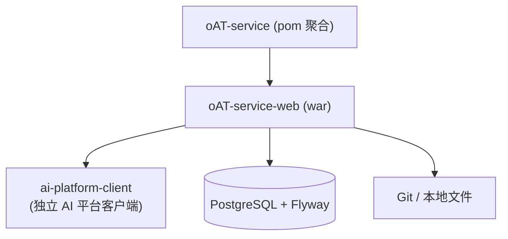

# oAT-service

`oAT-service` 是业务服务端 Maven **聚合模块**，构建产物为 `oAT-service-web`。AI 能力由独立项目 AI 平台（独立 git 仓库 `ai-platform` / 当前代码库 `ovanth`）提供，业务通过客户端 artifact 接入，本目录不再包含 AI 平台代码。

## 模块结构

```text
oAT-service/
├── pom.xml                # 聚合构建（modules: oAT-service-web）
└── oAT-service-web/       # 业务后端主服务，打包为 war
```

## 构建关系



## 子模块职责

| 模块 | 产物 | 职责 |
| --- | --- | --- |
| `oAT-service-web` | `war` | 平台 API、数据库迁移、项目/版本/用例、验证图谱、质量门禁、Git 影响分析和 AI 业务工具能力（经客户端调用独立 AI 平台） |

## AI 平台接入

- 独立项目位置：`../ai-platform/`（独立 git 仓库，含 `ai-platform-service` + `ai-platform-client`）
- 业务依赖：`com.aiplatform:ai-platform-client:0.1.0-SNAPSHOT`（需先 `mvn install` 安装到本地仓库）
- 客户端由启动类 `@ComponentScan(basePackages = {"com.oAT.web", "com.aiplatform.client"})` 扫描

## 构建

仓库没有在 `oAT-service/` 根目录放置独立 `mvnw`，可复用 `oAT-service-web` 下的 Maven wrapper。

```bash
# 构建全部服务端模块
cd oAT-service
./oAT-service-web/mvnw -f pom.xml clean install

# 运行服务端测试
./oAT-service-web/mvnw -f pom.xml test

# 只构建后端主服务
cd oAT-service/oAT-service-web
./mvnw -f ../pom.xml package -DskipTests
```

## 运行

```bash
cd oAT-service/oAT-service-web
./start.sh
```

`start.sh` 会运行：

```bash
java --enable-native-access=ALL-UNNAMED -Dio.netty.noUnsafe=true -jar target/oAT-service-web-1.0.0-SNAPSHOT.war
```

## 相关文档

- [oAT-service-web](oAT-service-web/README.md)
- [独立 AI 平台](../ai-platform/README.md)
