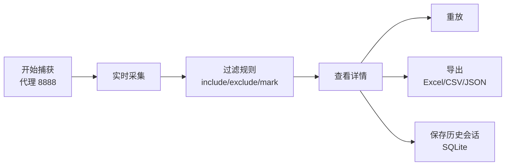

# oAT-traffic-capture

`oAT-traffic-capture` 是 ourAccurateTest 的**桌面流量采集器**，基于 Electron + Vue 3 构建。它用于测试过程中捕获、过滤、查看、重放和导出 HTTP/HTTPS、WebSocket、MQTT 等流量，并将采集结果导入验证工作区作为运行证据。

## 功能



- **HTTP/HTTPS 捕获**：通过本地代理记录请求、响应、状态码、耗时、Header 和 Body。
- **WebSocket 捕获**：记录 WS/WSS 连接和 send/receive 消息。
- **MQTT 与 MQ 手动录入**：支持 MQTT 连接采集，也支持补录 AMQP、MQTT、Kafka 等消息。
- **流量重放**：支持单条和批量重放 HTTP/HTTPS 记录，WebSocket 可重放已捕获的发送消息。
- **过滤规则**：按 URL、方法、协议、状态码、Header、Body 执行 include、exclude、mark。
- **统计图表**：展示协议分布、状态分布、Top Host、分钟趋势和基础统计。
- **历史会话**：使用 SQLite 保存会话、记录和规则。
- **数据导出**：支持 Excel、CSV、JSON。
- **插件扩展**：支持本地插件在捕获后、保存前处理流量记录。

## 技术栈

| 技术 | 用途 |
| --- | --- |
| Electron 30 | 桌面应用 |
| Vue 3 + TypeScript | 渲染进程 UI |
| Vite 5 | 构建与开发服务器 |
| Pinia | 状态管理 |
| http-mitm-proxy | HTTP/HTTPS 代理捕获 |
| better-sqlite3 | 本地会话存储 |
| ws / mqtt | WebSocket 与 MQTT |
| ExcelJS | Excel 导出 |

## 安装

```bash
cd oAT-traffic-capture
npm install
```

如 npm 源不可用，可切换官方源：

```bash
npm config set registry https://registry.npmjs.org/
npm install
```

## 开发运行

```bash
npm run dev          # 同时启动 Vite + Electron
# 或分开运行
npm run dev:vite
npm run dev:electron
```

## 构建与打包

```bash
npm run build        # 类型检查、前端构建、Electron 主进程构建
npm run start        # 构建后启动
npm run pack         # 生成解包目录
npm run dist         # 生成安装包，输出到 release/
```

## 使用流程

1. 启动应用，填写用例名称或流量描述。
2. 点击“开始捕获”。
3. 将系统或浏览器 HTTP/HTTPS 代理设置为 `127.0.0.1:8888`，也可使用界面中的系统代理开关。
4. 操作被测系统，流量会实时进入列表。
5. 按需过滤、查看详情、重放、导出或保存为历史会话。

## HTTPS / WSS 证书

HTTPS 和 WSS 捕获依赖 MITM 证书。首次使用：

1. 在界面中生成证书。
2. 安装并信任证书；macOS 可能需要管理员密码。
3. 自动安装失败时，打开证书目录，手动导入 `ca.pem` 并设置为始终信任。
4. 停止并重新开始捕获。
5. 重启浏览器或被测客户端。

未信任证书时，HTTP/WS 可以捕获，HTTPS/WSS 可能无法解密。

## 默认端口

| 端口 | 用途 |
| --- | --- |
| `8888` | HTTP/HTTPS 代理 |

## 插件

插件是采集器内部的流量处理插件，不是浏览器插件。每个插件一个目录：

```text
plugins/
  traffic-cleanup-plugin/
    package.json
    plugin.json
    index.js
```

支持 hook：

```js
export function onRecordCaptured(record) {
  return record
}

export function beforeSave(record) {
  return record
}
```

返回修改后的记录会继续处理；返回 `null` 会丢弃记录。

内置插件：

- `traffic-cleanup-plugin`：过滤 OPTIONS、静态资源，并标记 API、错误、慢请求。

## 项目结构

```text
oAT-traffic-capture/
├── electron/       # 主进程、代理、重放、证书、系统代理、插件、SQLite、MQTT
├── src/            # Vue 组件、Pinia store、类型、入口
├── resources/      # 打包额外资源
├── scripts/        # Electron 启动脚本
├── package.json
└── vite.config.ts
```

## 常见问题

### 捕获不到 HTTP/HTTPS

确认已经开始捕获，代理指向 `127.0.0.1:8888`，HTTPS 证书已信任，并且被测客户端没有绕过系统代理。

### WSS 捕获失败

WSS 依赖 HTTPS 证书信任。信任证书后重启浏览器或被测客户端。

### 重放失败：Failed to parse URL

旧记录可能只保存了相对路径。当前版本会尝试用 `Host` Header 补全 URL；缺少 Host 时需要重新捕获。

### 端口 8888 被占用

代理端口定义在 `electron/main.ts` 的 `PROXY_PORT`，修改后重新构建。

### 大量流量导致界面变慢

建议按用例分批采集，及时导出或保存历史会话，并清空当前列表。
