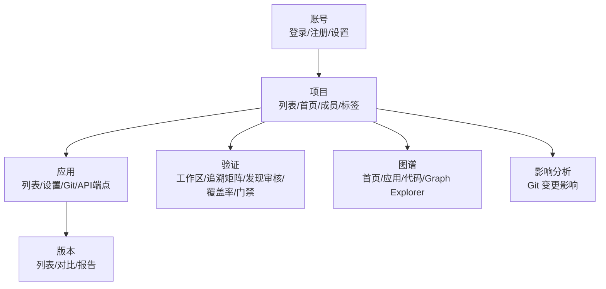

# oAT-web-frontend

`oAT-web-frontend` 是 ourAccurateTest 的 **Web 前端**，基于 Vue 3、TypeScript 和 Vite 构建。它通过 `/api` 调用 `oAT-service-web`，提供项目管理、版本中心、代码图谱、验证工作区、追溯矩阵、发现审核、覆盖率执行和质量门禁等页面。

## 技术栈

| 技术 | 用途 |
| --- | --- |
| Vue 3.5 | UI 框架 |
| TypeScript 5.9 | 类型系统 |
| Vite 7 | 开发服务器和构建 |
| Vue Router 4 | 路由 |
| Pinia 3 | 登录态和项目上下文状态 |

## 页面与路由



| 分类 | 页面 |
| --- | --- |
| 账号 | 登录、注册、账号设置 |
| 项目 | 项目列表、项目首页、成员、标签 |
| 应用 | 应用列表、应用设置、Git 仓库配置、API 端点 |
| 版本 | 应用版本列表、创建版本、版本对比、报告详情 |
| 验证 | 验证工作区、数据连接、追溯矩阵、发现审核、覆盖率执行、质量门禁 |
| 图谱 | 图谱首页、应用图谱、代码图谱、Graph Explorer |
| 影响分析 | Git 变更影响分析 |

## 目录结构

```text
oAT-web-frontend/
├── package.json
├── vite.config.ts
└── src/
    ├── api/             # HTTP 封装和业务 API 类型
    ├── components/      # 通用组件、图谱组件、刷新/分页/弹窗/Toast
    ├── composables/     # Dialog、Toast 等组合式函数
    ├── features/        # 按业务域组织的组件、样式和组合逻辑
    ├── layouts/         # AppShell 全局布局
    ├── pages/           # 路由页面
    ├── router/          # 路由表和鉴权守卫
    ├── shared/          # 跨模块共享组件、API 说明和工具
    ├── stores/          # auth、project 等全局状态
    └── utils/           # Markdown 等工具函数
```

## 安装与开发

```bash
cd oAT-web-frontend
npm install          # 建议 Node.js 18+
npm run dev          # http://localhost:5176，默认代理到 http://localhost:8899
```

修改后端地址：

```bash
OAT_BACKEND_TARGET='http://127.0.0.1:8899' npm run dev
```

## 构建与检查

```bash
npm run typecheck    # vue-tsc 类型检查
npm run build        # 先执行 vue-tsc --noEmit，类型错误会导致构建失败
npm run preview      # 本地预览 dist/（同样使用 5176 与 Vite proxy）
```

生产构建产物：`dist/`。生产环境建议用 Nginx / 网关 / 后端静态资源托管，并将 `/api`、`/share/api` 转发到 `oAT-service-web`。

## 后端集成

前端统一通过 `src/api/http.ts` 发起请求。主要 API 文件：

| 文件 | 说明 |
| --- | --- |
| `src/api/http.ts` | 请求封装、错误处理和认证态处理 |
| `src/api/types.ts` | 通用业务类型 |
| `src/api/bootstrap.ts` | 登录、项目上下文和初始化数据 |
| `src/api/version.ts` | 版本中心和 Git 工作流 |
| `src/api/verification.ts` | 验证资产、基线、分析、追溯矩阵、发现审核、质量门禁 |
| `src/api/graph.ts` | 图谱接口 |
| `src/api/traceabilityMap.ts` | 追溯图相关接口 |

## 路由与鉴权

路由定义在 `src/router/index.ts`。除 `/login`、`/register` 和 404 页面外，其余页面都会先执行登录态校验；进入项目内页面时还会加载并校验项目上下文。

登录状态由 `src/stores/auth.ts` 管理，项目列表和当前项目上下文由 `src/stores/project.ts` 管理。
